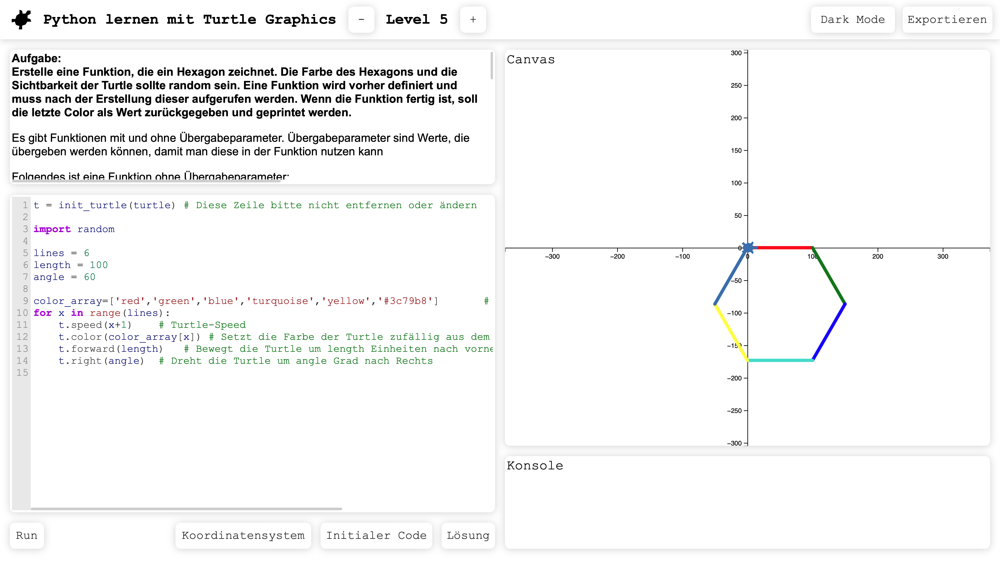

# Learn Python with Turtle Graphics
Szenario der Projektgruppe WS23/24 (Programmiererlebnisse) an der Hochschule Emden / Leer

### Stakeholder: 
- Prof. Dr. Carsten Link
- Frederik Gosewehr, M.Eng.
### Entwicklerteam:
- Tom Bohne
- Niklas Hagengers
- Noah Saibel


## Webanwendung zum interaktiven Erlernen von Python

Dieses Projekt ist im Rahmen des Moduls Projektgruppe an der Hochschule Emden/Leer entstanden.
Hierbei handelt es sich um eine interaktive Webanwendung, die Schülerinnen und Schülern ein Programmiererlebnis bietet. Die Webanwendung vermittelt spielerisch durch mehrere Level grundlegende Konzepte der Programmierung mit Python.
Die clientseitige Logik basiert auf Brython, während Turtle Graphics für die Visualisierung im interaktiven Lernprozess verwendet wird.

### Installation und Inbetriebnahme der Webanwendung
Mittels des Scripts [brython_turtle_init.sh](./scripts/brython_turtle_init.sh) wird die Webanwendung in einem Zielordner gecloned, der Server gestartet und das Frontend im Browser geöffnet. Die Hilfsfunktion des Scripts ist im Folgenden dargestellt:
```
Usage: ./brython_turtle_init.sh [options]
Initializes the Learn-Python-with-Turtle-Graphics repository, 
starts the Python HTTP-server and opens webapp.

Options:
  -dir, --directory DIRECTORY   Specify the target directory. Default is 'Learn-Python-with-Turtle-Graphics'.
  -h, --help                    Display this help message.
```
Existiert die Anwendung bereits im Zielordner wird gepullt um die neuste Version zu laden.

### Anleitungen
Die Dokumenation des Szenarios ist im Abschnitt 2 der Datei [Dokumentation.pdf](./documentation/Dokumentation.pdf) zu finden. Diese enthält neben einer Produktbeschreibung, die Dokumentation der Umsetzung und Hilfestellung für mögliche Weiterentwicklungen in Form von Schnittstellenbeschreibungen.  
  
Eine Anleitung für Schülerinnen und Schüler befindet sich in der Datei [Schüler-PDF.pdf](./documentation/Schueler-PDF.pdf). Diese enthält eine Bedienungsanleitung zur Webanwendung sowie auch  und Erläuterungen zu den Programmierkonzepten und zum Einsatz von Turtle Graphics.  
  
Die Datei [Lehrer-PDF.pdf](./documentation/Lehrer-PDF.pdf) dient als Anleitung für Dozentinnen und Dozenten. Diese beinhaltet Anleitungen zur Installation und Inbetriebnahme der Webanwendung, unterstützt beim Erstellen neuer Levels und gibt Anleitung zur Passwortänderung für Lösungen in der Webanwendung. Zusätzlich enthält die Lehrer-PDF Musterlösungen für jedes Level und Hilfestellungen bei typischerweise auftrettenden Fehlermeldungen.

### Lizenz
Dieses Projekt ist unter der GNU General Public License lizensiert. Bitte lesen Sie die [LICENSE.md](./LICENSE.md) für weitere Details.

### Externe Bibliotheken
Die folgenden externen Bibliotheken werden in diesem Projekt verwendet. Die jeweiligen Lizenzen finden Sie in den hinterlegten Lizenz-Dateien:

- [Brython](./lib/brython/LICENSE)
- [CodeMirror](./lib/codemirror/LICENSE)
- [D3.js](./lib/d3/LICENSE)
- [qrcode.js](./lib/qrcode/LICENSE)
